# [📈 Live Status](https://SRESchool.github.io/All-Jetexe-Websites-Uptime-Monitor): <!--live status--> **🟧 Partial outage**

This repository contains the open-source uptime monitor and status page for [SRESchool](https://SRESchool.github.io/All-Jetexe-Websites-Uptime-Monitor), powered by [Upptime](https://github.com/upptime/upptime).

With [Upptime](https://upptime.js.org), you can get your own unlimited and free uptime monitor and status page, powered entirely by a GitHub repository. We use [Issues](https://github.com/SRESchool/All-Jetexe-Websites-Uptime-Monitor/issues) as incident reports, [Actions](https://github.com/SRESchool/All-Jetexe-Websites-Uptime-Monitor/actions) as uptime monitors, and [Pages](https://SRESchool.github.io/All-Jetexe-Websites-Uptime-Monitor) for the status page.

<!--start: status pages-->
<!-- This summary is generated by Upptime (https://github.com/upptime/upptime) -->
<!-- Do not edit this manually, your changes will be overwritten -->
<!-- prettier-ignore -->
| URL | Status | History | Response Time | Uptime |
| --- | ------ | ------- | ------------- | ------ |
|  [Aiaviationacademy](https://aiaviationacademy.com) | 🟩 Up | [aiaviationacademy.yml](https://github.com/SRESchool/All-Jetexe-Websites-Uptime-Monitor/commits/HEAD/history/aiaviationacademy.yml) | 

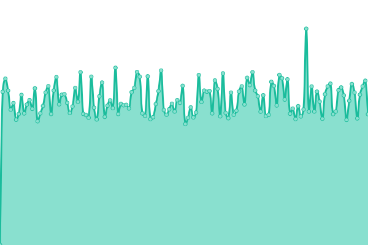 2274ms
     
 | 

<a href="https://SRESchool.github.io/All-Jetexe-Websites-Uptime-Monitor/history/aiaviationacademy">100.00%</a>
    

|  [aircrafto](https://aircrafto.com) | 🟩 Up | [aircrafto.yml](https://github.com/SRESchool/All-Jetexe-Websites-Uptime-Monitor/commits/HEAD/history/aircrafto.yml) | 

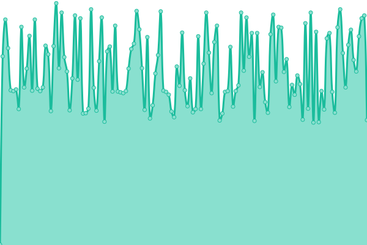 442ms
     
 | 

<a href="https://SRESchool.github.io/All-Jetexe-Websites-Uptime-Monitor/history/aircrafto">0.00%</a>
    

|  [Charterkings](https://charterkings.com) | 🟩 Up | [charterkings.yml](https://github.com/SRESchool/All-Jetexe-Websites-Uptime-Monitor/commits/HEAD/history/charterkings.yml) | 

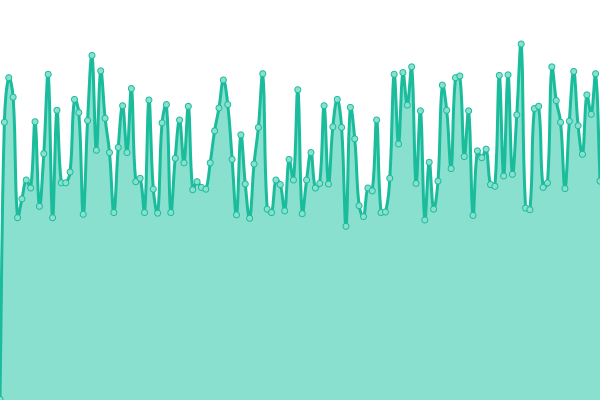 427ms
     
 | 

<a href="https://SRESchool.github.io/All-Jetexe-Websites-Uptime-Monitor/history/charterkings">100.00%</a>
    

|  [Executiveairrepair](https://executiveairrepair.com) | 🟩 Up | [executiveairrepair.yml](https://github.com/SRESchool/All-Jetexe-Websites-Uptime-Monitor/commits/HEAD/history/executiveairrepair.yml) | 

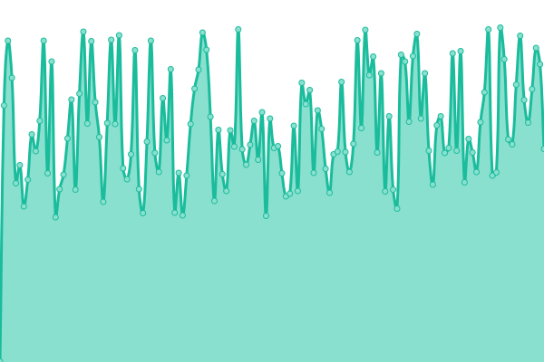 531ms
     
 | 

<a href="https://SRESchool.github.io/All-Jetexe-Websites-Uptime-Monitor/history/executiveairrepair">100.00%</a>
    

|  [Flighttrainingus](https://flighttrainingus.com) | 🟩 Up | [flighttrainingus.yml](https://github.com/SRESchool/All-Jetexe-Websites-Uptime-Monitor/commits/HEAD/history/flighttrainingus.yml) | 

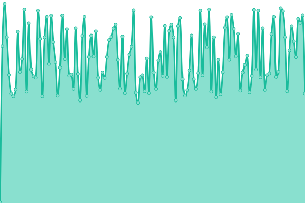 446ms
     
 | 

<a href="https://SRESchool.github.io/All-Jetexe-Websites-Uptime-Monitor/history/flighttrainingus">0.00%</a>
    

|  [flyaiaa](https://flyaiaa.com) | 🟩 Up | [flyaiaa.yml](https://github.com/SRESchool/All-Jetexe-Websites-Uptime-Monitor/commits/HEAD/history/flyaiaa.yml) | 

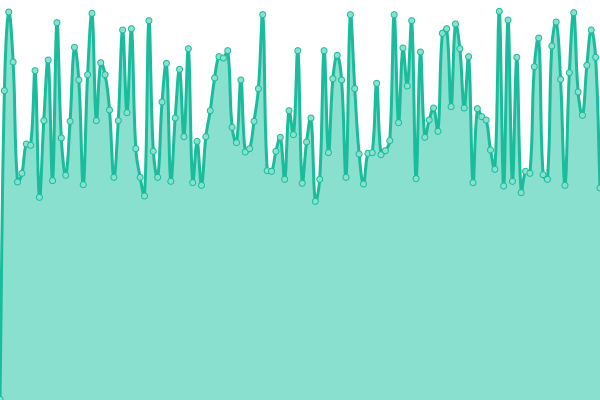 438ms
     
 | 

<a href="https://SRESchool.github.io/All-Jetexe-Websites-Uptime-Monitor/history/flyaiaa">0.00%</a>
    

|  [Jetandrotor](https://jetandrotor.com) | 🟥 Down | [jetandrotor.yml](https://github.com/SRESchool/All-Jetexe-Websites-Uptime-Monitor/commits/HEAD/history/jetandrotor.yml) | 

 0ms
     
 | 

<a href="https://SRESchool.github.io/All-Jetexe-Websites-Uptime-Monitor/history/jetandrotor">0.00%</a>
    

|  [Jetexe](https://jetexe.com) | 🟩 Up | [jetexe.yml](https://github.com/SRESchool/All-Jetexe-Websites-Uptime-Monitor/commits/HEAD/history/jetexe.yml) | 

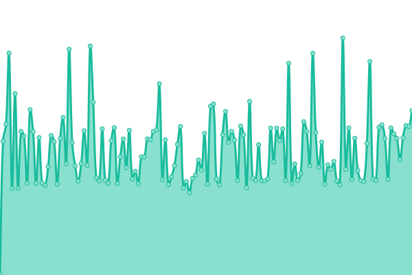 1457ms
     
 | 

<a href="https://SRESchool.github.io/All-Jetexe-Websites-Uptime-Monitor/history/jetexe">0.00%</a>
    

|  [kitplanepart](https://kitplanepart.com) | 🟩 Up | [kitplanepart.yml](https://github.com/SRESchool/All-Jetexe-Websites-Uptime-Monitor/commits/HEAD/history/kitplanepart.yml) | 

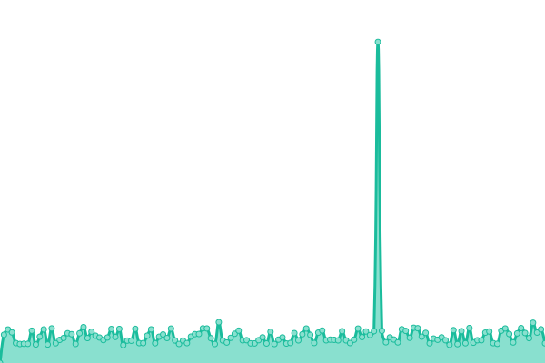 440ms
     
 | 

<a href="https://SRESchool.github.io/All-Jetexe-Websites-Uptime-Monitor/history/kitplanepart">100.00%</a>
    

|  [learnflying](https://learnflying.com) | 🟩 Up | [learnflying.yml](https://github.com/SRESchool/All-Jetexe-Websites-Uptime-Monitor/commits/HEAD/history/learnflying.yml) | 

 437ms
     
 | 

<a href="https://SRESchool.github.io/All-Jetexe-Websites-Uptime-Monitor/history/learnflying">100.00%</a>
    

|  [Lightsportwest](https://lightsportwest.com) | 🟩 Up | [lightsportwest.yml](https://github.com/SRESchool/All-Jetexe-Websites-Uptime-Monitor/commits/HEAD/history/lightsportwest.yml) | 

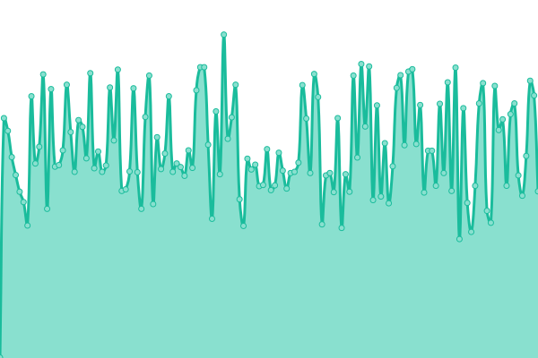 521ms
     
 | 

<a href="https://SRESchool.github.io/All-Jetexe-Websites-Uptime-Monitor/history/lightsportwest">0.00%</a>
    

|  [pilotsdeal](https://pilotsdeal.com) | 🟩 Up | [pilotsdeal.yml](https://github.com/SRESchool/All-Jetexe-Websites-Uptime-Monitor/commits/HEAD/history/pilotsdeal.yml) | 

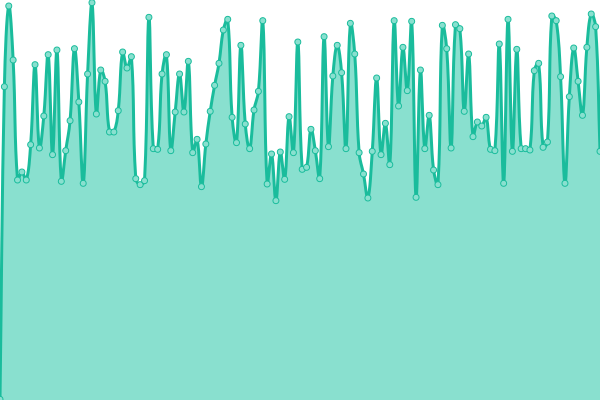 434ms
     
 | 

<a href="https://SRESchool.github.io/All-Jetexe-Websites-Uptime-Monitor/history/pilotsdeal">0.00%</a>
    

|  [pegasus-estates](https://pegasus-estates.com) | 🟩 Up | [pegasus-estates.yml](https://github.com/SRESchool/All-Jetexe-Websites-Uptime-Monitor/commits/HEAD/history/pegasus-estates.yml) | 

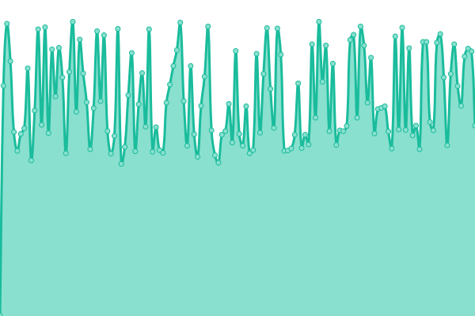 558ms
     
 | 

<a href="https://SRESchool.github.io/All-Jetexe-Websites-Uptime-Monitor/history/pegasus-estates">100.00%</a>
    

|  [pilotsindia](https://pilotsindia.com) | 🟩 Up | [pilotsindia.yml](https://github.com/SRESchool/All-Jetexe-Websites-Uptime-Monitor/commits/HEAD/history/pilotsindia.yml) | 

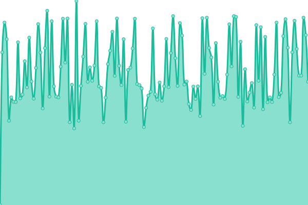 559ms
     
 | 

<a href="https://SRESchool.github.io/All-Jetexe-Websites-Uptime-Monitor/history/pilotsindia">100.00%</a>
    

|  [Pilottrainingus](https://pilottrainingus.com) | 🟩 Up | [pilottrainingus.yml](https://github.com/SRESchool/All-Jetexe-Websites-Uptime-Monitor/commits/HEAD/history/pilottrainingus.yml) | 

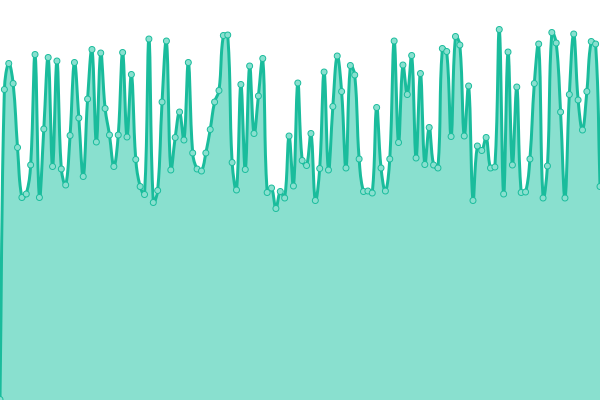 555ms
     
 | 

<a href="https://SRESchool.github.io/All-Jetexe-Websites-Uptime-Monitor/history/pilottrainingus">100.00%</a>
    

|  [Planespart](https://planespart.com) | 🟩 Up | [planespart.yml](https://github.com/SRESchool/All-Jetexe-Websites-Uptime-Monitor/commits/HEAD/history/planespart.yml) | 

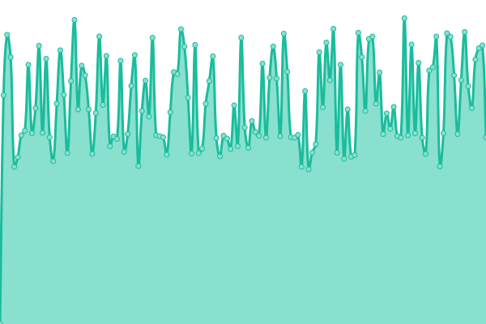 561ms
     
 | 

<a href="https://SRESchool.github.io/All-Jetexe-Websites-Uptime-Monitor/history/planespart">100.00%</a>
    

|  [Proezi](https://proezi.com) | 🟩 Up | [proezi.yml](https://github.com/SRESchool/All-Jetexe-Websites-Uptime-Monitor/commits/HEAD/history/proezi.yml) | 

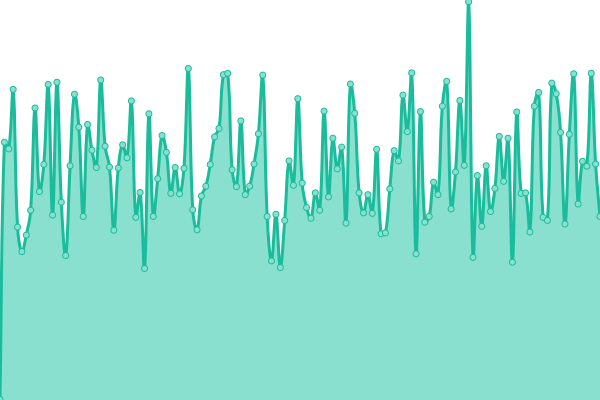 530ms
     
 | 

<a href="https://SRESchool.github.io/All-Jetexe-Websites-Uptime-Monitor/history/proezi">100.00%</a>
    

|  [Buymlocal](https://buymlocal.com) | 🟩 Up | [buymlocal.yml](https://github.com/SRESchool/All-Jetexe-Websites-Uptime-Monitor/commits/HEAD/history/buymlocal.yml) | 

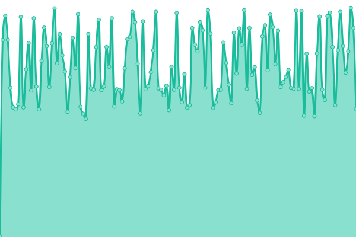 438ms
     
 | 

<a href="https://SRESchool.github.io/All-Jetexe-Websites-Uptime-Monitor/history/buymlocal">100.00%</a>
    

<!--end: status pages-->

[**Visit our status website →**](https://SRESchool.github.io/All-Jetexe-Websites-Uptime-Monitor)

## 📄 License

- Powered by: [Upptime](https://github.com/upptime/upptime)
- Code: [MIT](./LICENSE) © [Anand Chowdhary](https://anandchowdhary.com), supported by [Pabio](https://pabio.com)
- Data in the `./history` directory: [Open Database License](https://opendatacommons.org/licenses/odbl/1-0/)
